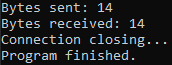
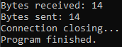

# Basic client-server socket program

## An educational project written in C

This project uses `Winsock2` from `Win32` to create client and server processes that use a TCP connection to exchange small amounts of data.

### Key Points

- Server is single-threaded and only accepts 1 socket connection
- Once the client and server exchange messages, both processes terminate
- The Microsoft Learn guide that was followed: [Getting Started with Winsock](https://learn.microsoft.com/en-us/windows/win32/winsock/getting-started-with-winsock)

### Prerequisites

- MinGW installed on your local Windows machine.

### Instructions
1. Navigate to the project folder
```bash
cd path/to/c-socket-basic
```
2. Compile the server project
```powershell
gcc -o server.exe server.c -lws2_32
```

3. Compile the client project
```powershell
gcc -o client.exe client.c -lws2_32
```

4. Run `server.exe`:
    ```bash
    ./server.exe
    ```

5. Run `client.exe` with the server name as the argument:
    ```bash
    ./client.exe <server-name>
    ```
    If you're running the client and server locally on your machine, you can pass `localhost` or `127.0.0.1` as the server name.

### Expected output

Client process:



Server process:

